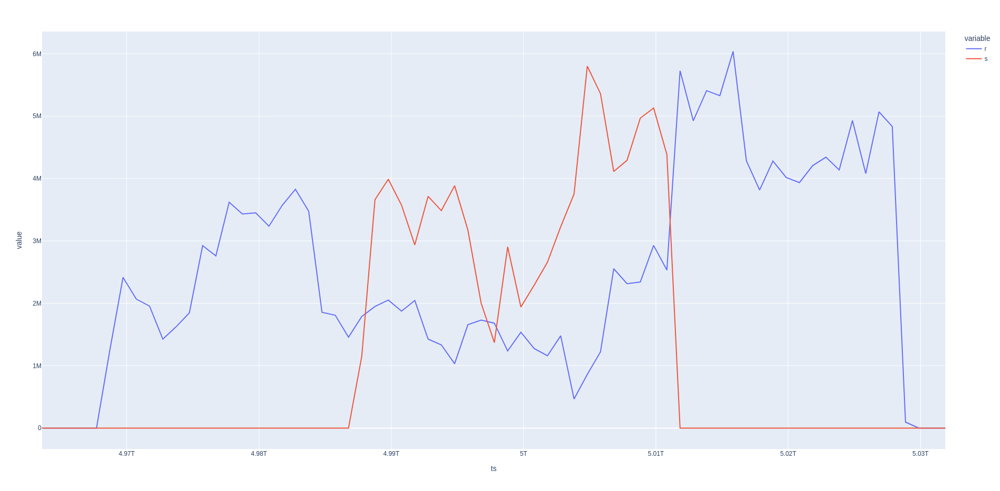
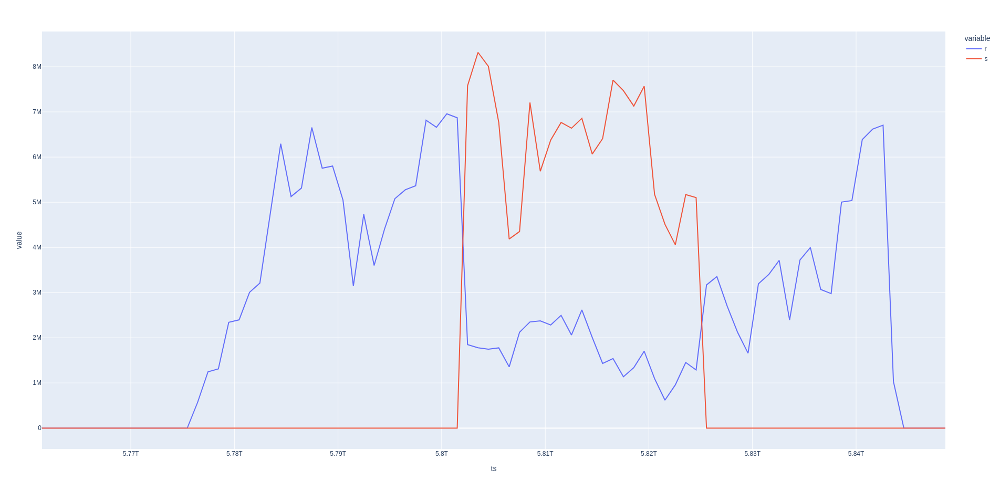

# Отчет

# Условия проведения эксперимента

Приложение-сервер UdpFlowCApp запускалось на компьютере с ОС Linux 
Android-приложение UdpFlow запускалось на Android-смартфоне.
Оба приложения по умолчанию готовы принимать UDP пакеты и обрабатывать команды.

Эксперимент подразумевает сбор статистики приема и отправки пакетов через UDP на клиенте.

Как проводится эксперимент:
* Запускается сервер и клиент
* На клиенте задается IP-адрес сервера.
* С клиента отправляется команда на сервер, начать передачу данных.
* Клиент начинает сам отправлять данные на сервер в течении некоторого времени.
* Клиент отправляет на сервер команду прекратить передачу данных.
* На клиенте собранные статистика сохраняется а csv-файл.
* Файл скачивается на компьютер и с помощью скрипта plot_gen.py генерируется график.

Что не сделано:
* Ограничение скорости отправки данных (rate limiter)
* Скорость отправки измеряется на отправляющей стороне, хотя логичнее измерять на стороне приема, и передавать статистику в единую точку сбора статистики. 

## 1-й эксперимент

Смартфон подключался к HotSpot на компьютере прямым WiFi подключениием

## 2-й эксперимент

Компьютер подключался к точке доступа запущенной на смартфоне прямым WiFi подключениием

## Выводы

Наблюдается некоторое падение прямого трафика

Также наблюдается неравномерность передачи данных даже без обратного трафика.

Видимо надо отключать домашние точки доступа и прочие устройства, закрывать другие приложения на устройствах, 
выбирать принудительно наиболее свободные Wi-Fi каналы, возможно другие меры для повышения "чистоты" эксперимента.
